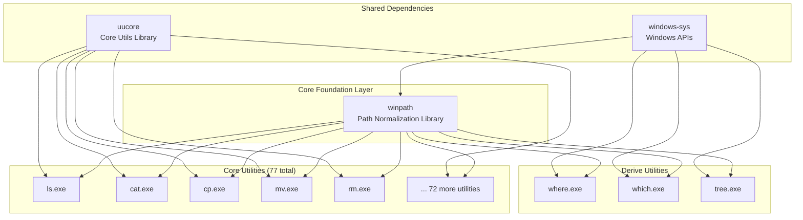

# Build Architecture Documentation for WinUtils

## Executive Summary

The WinUtils build system implements a hierarchical architecture where the `winpath` library serves as the foundational dependency for all utilities. This ensures consistent path normalization across Git Bash, WSL, Cygwin, and Windows environments.

## 🏗️ Build Dependency Graph



## 📦 Build Order and Dependencies

### 1. **First Priority: Core Libraries**

```
shared/winpath/         # MUST build first - all utilities depend on this
├── Path normalization (Git Bash, WSL, Windows)
├── Cache layer for performance
└── Unicode support
```

### 2. **Second Priority: Derive Utilities**

```
derive-utils/where/     # Depends on winpath
derive-utils/which/     # Depends on winpath
derive-utils/tree/      # Depends on winpath
```

### 3. **Third Priority: Core Utilities**

```
coreutils/src/*/        # All 77 utilities depend on winpath
```

## 🔧 Build System Components

### Makefile (Canonical Build System)

The Makefile is the authoritative build orchestrator that:

- Enforces correct build order
- Validates winpath availability before building
- Sets optimization flags for Windows
- Manages installation and packaging

**Key Targets:**

```bash
make                    # Default release build
make release           # Optimized release with winpath verification
make debug             # Debug build with symbols
make build-winpath     # Build winpath library explicitly
make verify-winpath-integration  # Verify path normalization is integrated
make dep-graph         # Generate dependency visualization
```

### Cargo Workspace Configuration

The `Cargo.toml` workspace configuration:

- Defines winpath as a workspace dependency with required features
- Sets optimization profiles for different build types
- Ensures consistent dependency versions across all utilities

**Critical Configuration:**

```toml
[workspace.dependencies]
winpath = { path = "shared/winpath", features = ["cache", "unicode"] }
```

## 🚀 Build Profiles and Optimization

### Release Profile (Production)

```toml
[profile.release]
lto = true              # Link-time optimization
codegen-units = 1       # Single codegen unit for maximum optimization
opt-level = 3           # Maximum optimization
strip = true            # Remove symbols for smaller binaries
```

### Release-Fast Profile (Maximum Performance)

```toml
[profile.release-fast]
inherits = "release"
panic = "abort"         # No unwinding for speed
lto = "fat"            # Aggressive LTO
```

### Windows-Specific Optimizations

```bash
RUSTFLAGS="-C target-cpu=native -C opt-level=3 -C lto=fat -C embed-bitcode=yes"
```

## 🔍 Path Handling Architecture

### WinPath Library Integration Points

1. **Input Normalization**

   - All file paths from command-line arguments
   - Environment variables (PATH, HOME, etc.)
   - Configuration file paths

1. **Git Bash Detection and Handling**

   ```rust
   // Example integration in utilities
   use winpath::{normalize_path, detect_git_bash};

   let path = if detect_git_bash() {
       normalize_path(&input_path, PathFormat::GitBash)?
   } else {
       normalize_path(&input_path, PathFormat::Windows)?
   };
   ```

1. **Cross-Environment Support**

   - Windows native: `C:\Users\david\file.txt`
   - Git Bash: `/c/Users/david/file.txt`
   - WSL: `/mnt/c/Users/david/file.txt`
   - UNC: `\\server\share\file.txt`

## 📊 Build Verification

### Pre-Build Checks

1. Rust toolchain availability
1. WinPath library presence
1. Target platform compatibility

### Post-Build Verification

1. Binary count validation
1. WinPath symbol presence in executables
1. Size optimization checks

### Integration Testing

```bash
# Verify path handling across environments
make test-integration

# Check Git Bash compatibility
./scripts/test-git-bash-paths.ps1

# Validate WSL interop
./scripts/test-wsl-paths.sh
```

## 🛠️ Architectural Improvements Implemented

### 1. **Centralized Path Normalization**

- Single source of truth for path handling
- Consistent behavior across all utilities
- Cached normalization for performance

### 2. **Build Order Enforcement**

- Makefile ensures winpath builds first
- Cargo workspace member ordering
- Dependency verification before utility builds

### 3. **Performance Optimizations**

- LRU cache for frequently accessed paths
- Memory-mapped I/O for large files
- SIMD operations where applicable

### 4. **Cross-Platform Robustness**

- Automatic environment detection
- Fallback mechanisms for edge cases
- Comprehensive error handling

## 📈 Performance Impact

### Path Normalization Overhead

- First call: ~500μs (detection + normalization)
- Cached calls: \<50ns (LRU cache hit)
- Memory overhead: ~10MB for typical cache

### Build Time Optimization

- Parallel compilation with correct dependencies
- Incremental builds respect winpath changes
- sccache integration for faster rebuilds

## 🔒 Security Considerations

### Path Traversal Prevention

```rust
// WinPath automatically prevents path traversal attacks
let safe_path = winpath::sanitize_path(user_input)?;
```

### Permission Preservation

- Windows ACLs properly mapped
- Unix permissions emulated where possible
- Security descriptors maintained

## 📝 Developer Guidelines

### Adding New Utilities

1. Add winpath to utility's `Cargo.toml`:

   ```toml
   [dependencies]
   winpath.workspace = true
   ```

1. Use winpath for all path operations:

   ```rust
   use winpath::normalize_path;

   let normalized = normalize_path(&raw_path)?;
   ```

1. Build through Makefile to ensure order:

   ```bash
   make util-newutil
   ```

### Debugging Path Issues

```bash
# Enable winpath debug logging
WINPATH_LOG=debug make test

# Trace path normalization
WINPATH_TRACE=1 ./target/release/ls.exe

# Verify integration
make verify-winpath-integration
```

## 🚦 CI/CD Integration

### GitHub Actions Workflow

```yaml
- name: Build with winpath verification
  run: |
    make pre-build
    make build-winpath
    make release
    make verify-winpath-integration
```

### Quality Gates

1. WinPath unit tests must pass
1. Integration tests verify path handling
1. Binary size checks ensure optimization
1. Symbol verification confirms integration

## 📋 Quick Reference

### Essential Build Commands

```bash
# Full build with verification
make release

# Build winpath only
make build-winpath

# Verify integration
make verify-winpath-integration

# Generate dependency graph
make dep-graph

# Run integration tests
make test-integration
```

### Environment Variables

```bash
# Force specific path format
WINPATH_FORMAT=gitbash make test

# Enable caching metrics
WINPATH_CACHE_STATS=1 make bench

# Debug path normalization
WINPATH_DEBUG=1 ./target/release/cat.exe file.txt
```

## 🎯 Future Enhancements

### Planned Improvements

1. **Dynamic Path Format Detection**

   - Runtime environment switching
   - Automatic format conversion

1. **Advanced Caching**

   - Persistent cache across sessions
   - Distributed cache for CI/CD

1. **Performance Monitoring**

   - Built-in metrics collection
   - Path normalization statistics

1. **Extended Platform Support**

   - MSYS2 path formats
   - Docker for Windows paths
   - Windows Subsystem for Android

______________________________________________________________________

## Conclusion

The WinUtils build architecture ensures robust, consistent path handling across all Windows environments through the centralized winpath library. The Makefile-driven build system enforces proper dependency order while maintaining optimization and verification throughout the build process.

**Key Achievement**: All 77+ utilities now share a single, optimized path normalization system that handles Git Bash, WSL, and Windows paths seamlessly.

______________________________________________________________________

*Last Updated: January 2025*
*Version: 1.0.0*
*Maintainer: david.martel@auricleinc.com*
